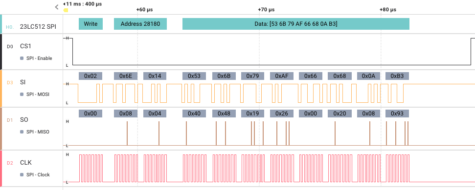
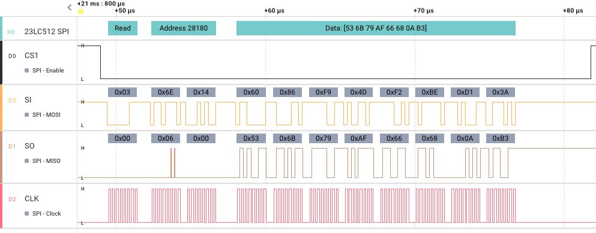
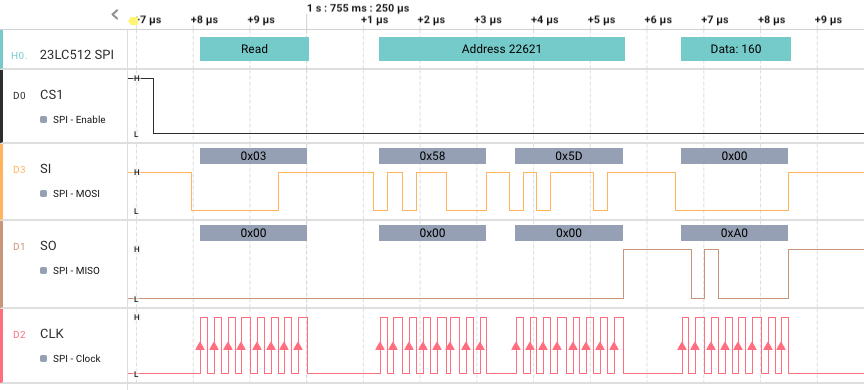
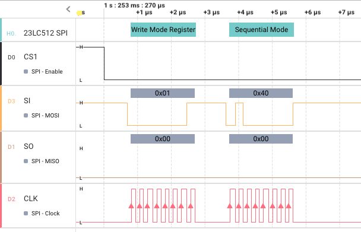
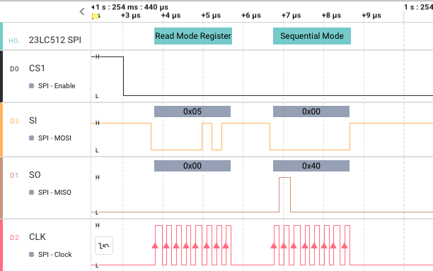

# 23LC512 SPI Analyzer

This is version 0.0.3 of a Saleae Logic Analyzer extension to decode SPI messages sent to and from a Microchip <a href="https://ww1.microchip.com/downloads/aemDocuments/documents/MPD/ProductDocuments/DataSheets/23A512-23LC512-512-Kbit-SPI-Serial-SRAM-with-SDI-and-SQI-Interface-20005155C.pdf">23LC512</a> (or 23A512) 512-Kbit SPI Serial SRAM.

This chip supports three different modes:

* Byte
* Page
* Sequential

Version 0.0.3 of this analyzer now supports decoding **Sequential** and **Byte** mode of the 23LC512.  In the future **Page** mode will also be supported.

## 0.0.3

* Default mode is **Sequential** (the default mode of the chip itself)
* Support for decoding both **Sequential** and **Byte** Mode
* Support for decoding **Write Mode** and **Read Mode Register**

Examples:

**Write Bytes**

**Read Bytes**

  
## 0.0.2

* Only Byte mode supported for decoding writes and reads
* Decoding **Write** instruction supported
* Decoding **Read** instruction supported
* Decoding **Write Mode Register** instruction
* Decoding **Read Mode Register** instruction

Examples:

**Write Byte**

**Read Byte**

**Write Mode Register**

**Read Mode Register**

## 0.0.1

* Initial version
* **Byte** mode supported
* Decoding **Write** instruction supported
* Decoding **Read** instruction supported

## 0.0.4 Plans

* Support for **Page** mode decoding

  